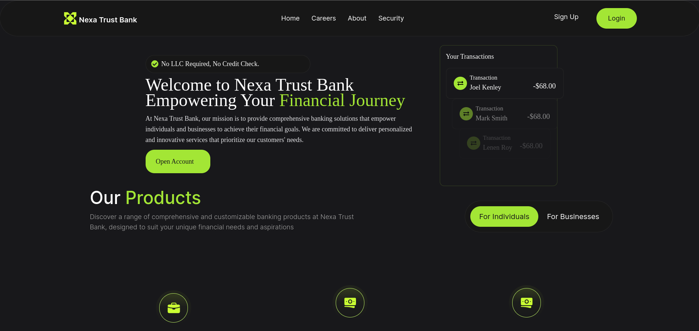
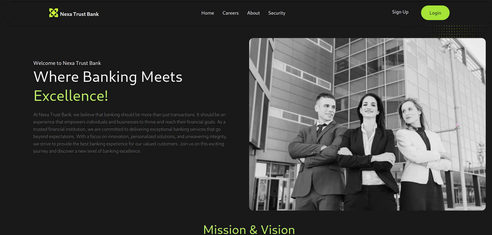
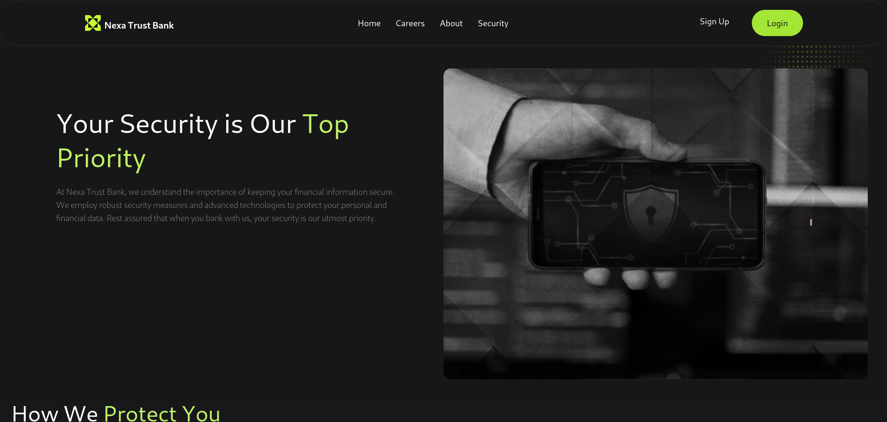
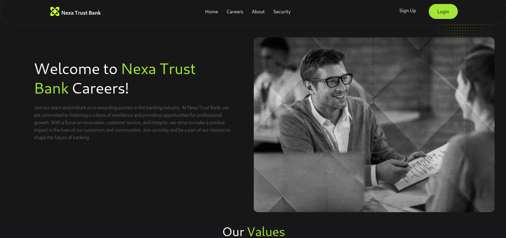
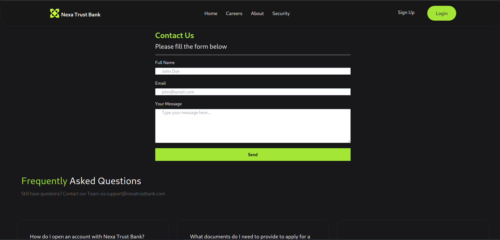

# NexaTrust: Next.js Banking System











NexaTrust is a modern banking system built with Next.js 14, Firebase Authentication, Firebase Realtime Database, and MongoDB. It offers a secure and seamless banking experience for users, allowing them to manage their finances efficiently.

## Features

- **User Authentication**: Secure user authentication powered by Firebase Authentication.
- **Realtime Data Storage**: Firebase Realtime Database ensures seamless storage and retrieval of user data.
- **Contact Form**: MongoDB is utilized to manage messages submitted through the contact form.
- **Responsive Design**: Bankly is built with a responsive design, ensuring compatibility across various devices.

## Installation

To run Nexatrust locally, follow these steps:

1. Clone the repository:
   ```bash
   git clone https://github.com/jeshi2/Nexa_Trust_Bank.git
   ```

2. Navigate to the project directory:
   ```bash
   cd Nexa_Trust_Bank
   ```

3. Install dependencies:
   ```bash
   npm install
   ```

4. Set up Firebase Authentication:
   - Create a Firebase project in the [Firebase Console](https://console.firebase.google.com/).
   - Enable Firebase Authentication and follow the setup instructions.
   - Copy your Firebase configuration settings.
   - Create a `.env.local` file in the root directory and add your Firebase configuration:
     ```
     NEXT_PUBLIC_FIREBASE_API_KEY=your-api-key
     NEXT_PUBLIC_FIREBASE_AUTH_DOMAIN=your-auth-domain
     NEXT_PUBLIC_FIREBASE_PROJECT_ID=your-project-id
     NEXT_PUBLIC_FIREBASE_STORAGE_BUCKET=your-storage-bucket
     NEXT_PUBLIC_FIREBASE_MESSAGING_SENDER_ID=your-sender-id
     NEXT_PUBLIC_FIREBASE_APP_ID=your-app-id
     ```

5. Set up MongoDB:
   - Ensure you have MongoDB installed and running locally or set up a remote MongoDB instance.
   - Add your MongoDB connection URI to the `.env.local` file:
     ```
     MONGODB_URI=your-mongodb-uri
     ```

6. Run the development server:
   ```bash
   npm run dev
   ```

7. Open your browser and navigate to `http://localhost:3000` to view NexaTrust.

## Hosting

NexaTrust is hosted on [NexaTrust]([https://vercel.com](https://nexa-trust-bank.vercel.app/)). It's automatically deployed whenever changes are pushed to the `main` branch.

## Usage

- Register for a new account or log in with existing credentials.
- Explore your account dashboard to view balances, transactions, and other banking activities.
- Use the contact form to submit inquiries or messages, which will be stored in the MongoDB database.

## Contributing

Contributions to NexTrust are welcome! Feel free to submit bug reports, feature requests, or pull requests.

1. Fork the repository.
2. Create your feature branch (`git checkout -b feature/new-feature`).
3. Commit your changes (`git commit -am 'Add new feature'`).
4. Push to the branch (`git push origin feature/new-feature`).
5. Open a pull request.

## License

NexTrust is licensed under the [MIT License](LICENSE).

## Support

For support or inquiries, please contact [anonymousveans@gmail.com](mailto:anonymousveans@gmail.com).
